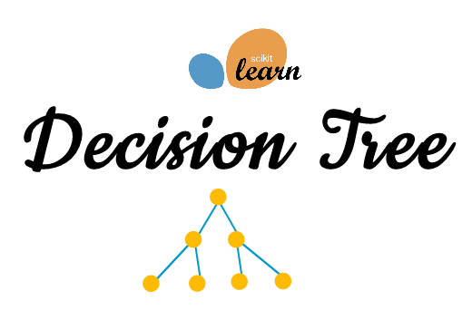

### DSR Trees

This repository contains teaching materials for the course on 'Trees' at Data Science Retreat,Berlin.

### Contents 

The data folder contains sample data, for examples and exercises, while the images for images attached to the notebooks.

Topics considered include: 

**Decision Trees.

**Ensemble Methods:Bagging

-- Random Forest, ExtraTrees

**Ensemble Methods:Boosting

-- Adaboost, Gradient Boosted Trees

**Encodings

--Mean encoding, label encoding, target encoding etc.
  